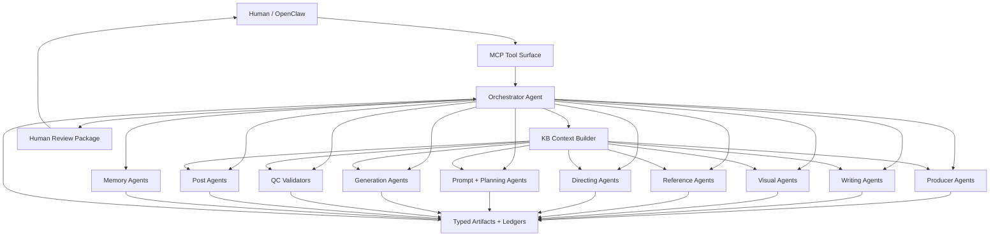

# Agent Architecture

## Purpose

The film studio should use many narrow expert agents coordinated by one orchestrator. Agents
should not behave like a loose chat room. They should exchange typed artifacts, validation
reports, issues, and decisions through the graph state.

The goal is a professional studio structure:

- one orchestrator owns flow and arbitration
- specialist creator agents produce artifacts
- reviewer agents critique creative choices
- validator agents score against schemas and rubrics
- operator agents handle providers, budgets, checkpoints, and failures
- human review remains mandatory at phase gates

## Core Rule

Agents do not pass unstructured prose to each other as the source of truth.

They communicate through:

- artifacts
- artifact versions
- matrix rows
- ledgers
- validation reports
- issue records
- review packages
- orchestrator decisions

This makes the system inspectable through MCP and resumable through LangGraph.

## Agent Families

### 1. Orchestrator Agent

Owns the production flow.

Responsibilities:

- resolve project and current phase
- select next graph node
- choose specialist agents by capability
- build KB context packets
- enforce profile policy
- route artifacts between agents
- run validation gates
- create human review packages
- pause for approval
- arbitrate disagreements
- protect budget and provider limits
- resume from checkpoints
- explain state through MCP

The orchestrator should not:

- write every creative artifact itself
- validate its own work
- hide disagreement between reviewers
- skip human gates
- retry expensive provider calls without policy approval

### 2. Producer And Planning Agents

These agents make the project executable.

Agents:

- `project-producer-agent`
- `intake-classifier-agent`
- `config-inference-agent`
- `feasibility-scout-agent`
- `schedule-planning-agent`
- `budget-planning-agent`
- `risk-register-agent`

Typical artifacts:

- project brief
- project config
- feasibility report
- budget forecast
- schedule plan
- risk register

Relationship:

- feed the orchestrator with constraints
- inform all downstream teams
- trigger human review when scope, budget, or provider assumptions are risky

### 3. Creative Development Agents

These agents turn the first idea into a strong film concept.

Agents:

- `concept-expansion-agent`
- `logline-agent`
- `premise-agent`
- `theme-agent`
- `tone-agent`
- `story-structure-agent`
- `act-architect-agent`
- `treatment-agent`
- `symbolism-agent`

Typical artifacts:

- film constitution
- logline
- premise
- treatment
- act map
- theme map
- setup/payoff map

Review partners:

- `narrative-density-validator`
- `theme-coherence-validator`
- `act-structure-validator`
- `audience-promise-reviewer`

### 4. Screenwriting Agents

These agents create the script and scene-level intent.

Agents:

- `scene-beat-agent`
- `screenwriter-agent`
- `dialogue-agent`
- `character-arc-agent`
- `pacing-agent`
- `subtext-agent`
- `scene-intent-agent`

Typical artifacts:

- scene list
- scene intent sheets
- script
- dialogue pass
- character arc map
- pacing notes

Review partners:

- `scene-writing-validator`
- `dialogue-voice-validator`
- `character-arc-validator`
- `theme-review-agent`
- `pacing-validator`

### 5. Visual Development Agents

These agents lock the visual identity before generation.

Agents:

- `character-dossier-agent`
- `wardrobe-agent`
- `environment-bible-agent`
- `location-map-agent`
- `zone-and-viewpoint-agent`
- `lighting-state-agent`
- `camera-language-agent`
- `style-bible-agent`
- `reference-brief-agent`
- `reference-strategy-planner`

Typical artifacts:

- character bible
- wardrobe rules
- environment bible
- location map
- zone and viewpoint map
- lighting profiles
- camera language bible
- visual style bible
- reference strategy

Review partners:

- `character-dossier-validator`
- `environment-bible-validator`
- `camera-language-validator`
- `style-bible-validator`
- `reference-usability-validator`

### 6. Reference Image Agents

These agents create and validate the most important visual anchors.

Agents:

- `character-reference-agent`
- `environment-reference-agent`
- `prop-reference-agent`
- `composition-reference-agent`
- `reference-sheet-builder-agent`
- `reference-index-agent`

Typical artifacts:

- character identity sheets
- environment boards
- prop boards
- camera framing references
- composite reference sheets
- reference index

Review partners:

- `visual-identity-reviewer`
- `production-usability-reviewer`
- `continuity-reference-reviewer`
- `provider-risk-reviewer`
- `bad-reference-detector`

### 7. Directing And Shot Design Agents

These agents convert approved writing and visual bibles into executable shots.

Agents:

- `shot-design-agent`
- `blocking-agent`
- `camera-blocking-agent`
- `coverage-planning-agent`
- `multi-angle-planning-agent`
- `continuity-ledger-agent`
- `creative-risk-register-agent`

Typical artifacts:

- shot bible
- master film matrix
- coverage group plan
- blocking plan
- state in/out records
- continuity ledger
- creative risk register

Review partners:

- `shot-design-validator`
- `scene-flow-validator`
- `spatial-logic-validator`
- `coverage-value-validator`
- `continuity-validator`

### 8. Prompt And Generation Planning Agents

These agents prepare safe, provider-ready prompt packages.

Agents:

- `prompt-composition-agent`
- `negative-prompt-agent`
- `prompt-package-agent`
- `provider-planning-agent`
- `model-routing-agent`
- `cost-estimation-agent`
- `generation-scheduler-agent`
- `re-anchor-planning-agent`

Typical artifacts:

- RCTCO prompt packages
- provider plan
- model routing plan
- cost estimate
- generation schedule
- re-anchor plan
- checkpoint plan

Review partners:

- `prompt-readiness-validator`
- `provider-feasibility-validator`
- `budget-feasibility-validator`
- `reference-risk-validator`

### 9. Generation Execution Agents

These agents operate the provider layer. They should be conservative because mistakes cost
money.

Agents:

- `generation-runner-agent`
- `provider-monitor-agent`
- `checkpoint-agent`
- `clip-ingestion-agent`
- `last-frame-extraction-agent`
- `generation-ledger-agent`
- `failure-handling-agent`
- `mock-provider-scenario-agent`

Typical artifacts:

- generation ledger records
- provider job records
- generated clips
- last-frame captures
- mid-frame captures
- ingestion reports
- failure decisions
- resume snapshots
- mock scenario reports

Review partners:

- `provider-health-validator`
- `duplicate-generation-guard`
- `chain-readiness-validator`
- `mock-scenario-validator`

### 10. Multi-Level QC Agents

These agents validate the film at increasing scopes.

Clip-level agents:

- `clip-quality-validator`
- `prompt-adherence-validator`
- `artifact-detector`
- `clip-character-consistency-validator`
- `clip-environment-fidelity-validator`
- `motion-continuity-validator`
- `last-frame-usability-validator`

Scene-level agents:

- `scene-continuity-validator`
- `scene-flow-validator`
- `scene-intent-validator`
- `scene-emotional-truth-validator`

Act-level agents:

- `act-continuity-validator`
- `act-structure-validator`
- `act-pacing-validator`
- `act-escalation-validator`

Full-movie agents:

- `full-movie-flow-validator`
- `full-movie-coherence-validator`
- `setup-payoff-validator`
- `theme-completion-validator`
- `audience-experience-validator`

Typical artifacts:

- clip QC reports
- scene QC reports
- act QC reports
- full movie QC report
- revision recommendations

### 11. Post-Production Agents

These agents assemble and finish the movie.

Agents:

- `assembly-agent`
- `editor-agent`
- `transition-agent`
- `audio-design-agent`
- `music-agent`
- `audio-sync-agent`
- `color-agent`
- `subtitle-agent`
- `delivery-packaging-agent`

Review partners:

- `timeline-validator`
- `transition-validator`
- `audio-sync-validator`
- `color-continuity-validator`
- `delivery-validator`

Typical artifacts:

- assembly manifest
- edit decision list
- review cut
- audio plan
- color plan
- delivery package

### 12. Memory And Operations Agents

These agents help the studio improve.

Agents:

- `lessons-agent`
- `failure-memory-agent`
- `kb-curator-agent`
- `archive-agent`
- `cost-report-agent`
- `postmortem-agent`

Typical artifacts:

- lessons learned
- KB lesson cards
- provider incident records
- cost report
- archive manifest
- postmortem draft

## Relationship Model

Use a hub-and-spoke model with artifact contracts.



Agents should not call each other freely. The orchestrator routes work and records the
reason. This prevents hidden side effects and keeps MCP inspection truthful.

## Handoff Pattern

Every agent handoff should have the same shape.

```json
{
  "handoff_id": "handoff:scene-beat-to-screenwriter:S001:v1",
  "from_agent": "scene-beat-agent",
  "to_agent": "screenwriter-agent",
  "project_id": "film_2026_0001",
  "input_artifact_refs": [
    "artifact:scene-intent:S001:v1",
    "artifact:character-bible:v2"
  ],
  "kb_context_ref": "kbctx:screenwriter:S001:v1",
  "task": "Draft scene S001 using approved beats and character voice rules.",
  "expected_output_schema": "artifact:schema:script-scene:v1",
  "validation_required": [
    "scene-writing-validator",
    "dialogue-voice-validator"
  ]
}
```

## Creator, Reviewer, Validator Loop

The default pattern should be:

```text
creator agent -> reviewer agent -> validator agent -> orchestrator decision -> human gate
```

Example:

```text
screenwriter-agent
-> theme-review-agent
-> scene-writing-validator
-> orchestrator synthesis
-> human review
```

Rules:

- creators create or revise artifacts
- reviewers provide creative critique and tradeoffs
- validators produce structured scores and blocking issues
- synthesizers merge disagreements
- the orchestrator decides next step
- the human approves at gates

## Collaboration Patterns

### Sequential Pipeline

Use when one artifact depends on another.

Example:

```text
treatment -> scene intents -> script -> shot bible -> prompts
```

### Parallel Specialist Panel

Use when one artifact needs multiple independent reviews.

Example:

```text
script -> dialogue validator
script -> theme validator
script -> pacing validator
script -> character arc validator
```

### Debate And Synthesis

Use when reviewers disagree.

Flow:

1. collect independent reports
2. identify disagreements
3. ask synthesizer to summarize tradeoffs
4. orchestrator recommends a path
5. human decides if creative stakes are high

### Red Team Review

Use before expensive or irreversible work.

Examples:

- before production generation
- before provider switch
- before final delivery
- before accepting references for main characters

The red team should search for failure modes, not polish the artifact.

### Repair Loop

Use when validation fails.

Flow:

1. validator creates issue
2. orchestrator classifies severity
3. repair agent receives narrow task
4. validator re-checks only affected scope
5. orchestrator updates dependency invalidation

## Agent Contracts

Every agent should be registered.

```json
{
  "agent_id": "dialogue-agent",
  "family": "screenwriting",
  "role": "creator",
  "capabilities": ["dialogue", "voice_consistency", "subtext"],
  "input_artifacts": ["scene_intent", "character_bible", "script_draft"],
  "output_artifacts": ["dialogue_pass"],
  "allowed_kb_domains": ["creative-writing", "dialogue", "character"],
  "blocked_kb_domains": ["provider", "cost"],
  "prompt_framework": "RCTCO",
  "default_model_profile": "creative_writer",
  "reviewed_by": ["dialogue-voice-validator"],
  "failure_modes": ["generic_voice", "overwriting_character_truth", "tone_drift"]
}
```

Required fields:

- `agent_id`
- `family`
- `role`
- `capabilities`
- `input_artifacts`
- `output_artifacts`
- `allowed_kb_domains`
- `prompt_framework`
- `default_model_profile`
- `reviewed_by`
- `failure_modes`

## Agent Roles

Use explicit roles:

- `orchestrator`
- `creator`
- `reviewer`
- `validator`
- `synthesizer`
- `operator`
- `curator`

The same agent should not normally be both creator and validator for the same artifact.

## Orchestrator Routing Rules

The orchestrator should select agents dynamically. It should not run a fixed sequence just
because a phase name says so.

The orchestrator selects agents using:

- current phase
- requested MCP tool
- project profile
- artifact type
- missing outputs
- validation failures
- agent capabilities
- model availability
- budget and provider policy
- human instructions
- available registered actions
- dependency/invalidation state

The orchestrator should first compute eligible actions, then choose the agent or validator
best suited for the selected action.

Routing should be explainable:

```json
{
  "routing_decision_id": "route:S001:dialogue:v1",
  "selected_agent": "dialogue-agent",
  "reason": "Scene writing validator flagged weak character voice.",
  "input_refs": ["artifact:script:S001:v2", "artifact:character-bible:v1"],
  "expected_output": "dialogue_revision",
  "requires_human_review": false
}
```

## Escalation Rules

Escalate to the human when:

- reviewers disagree on a major creative direction
- validation blocks an approved artifact
- a repair would change film constitution
- cost increases above profile threshold
- provider switch changes visual quality or price
- generated media has severe identity or environment drift
- rollback affects approved artifacts
- final delivery changes runtime, structure, or tone

Escalate to failure-handling agent when:

- provider errors are ambiguous
- credit or quota is exhausted
- job id exists but status is unclear
- repeated validator infrastructure errors occur
- duplicate generation risk exists

Escalate to KB curator when:

- active policies conflict
- a project lesson should become a reusable playbook
- an old rule appears to contradict current direction
- a source is untrusted or stale

## Agent Memory

Agents should not keep private long-term memory.

Use shared memory:

- project state
- artifacts
- ledgers
- KB context packets
- issue records
- decision records

Short-term scratch reasoning can exist during a single run, but important decisions must be
persisted as artifacts or decision records.

## Human Relationship

The human is the creative owner.

Agents may recommend, critique, warn, and revise, but human approval is mandatory for:

- project config
- film constitution
- treatment
- script
- visual bible
- reference package
- shot bible
- generation spend
- generated batch acceptance
- final cut
- KB promotion of important lessons

## Minimum MVP Agent Set

Start with a small but complete studio skeleton:

- `orchestrator-agent`
- `intake-classifier-agent`
- `config-inference-agent`
- `film-constitution-agent`
- `treatment-agent`
- `screenwriter-agent`
- `character-dossier-agent`
- `environment-bible-agent`
- `reference-strategy-planner`
- `shot-design-agent`
- `prompt-composition-agent`
- `continuity-ledger-agent`
- `provider-planning-agent`
- `generation-scheduler-agent`
- `clip-validator`
- `scene-continuity-validator`
- `full-movie-flow-validator`
- `failure-handling-agent`
- `kb-curator-agent`

This MVP is enough to prove orchestration, artifact handoffs, human review, KB-scoped
context, and validation before adding every specialized agent.
