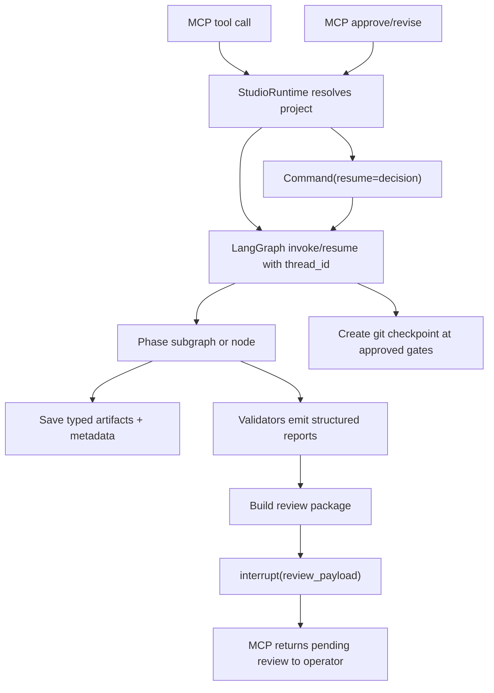
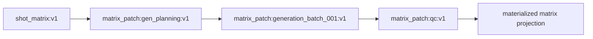
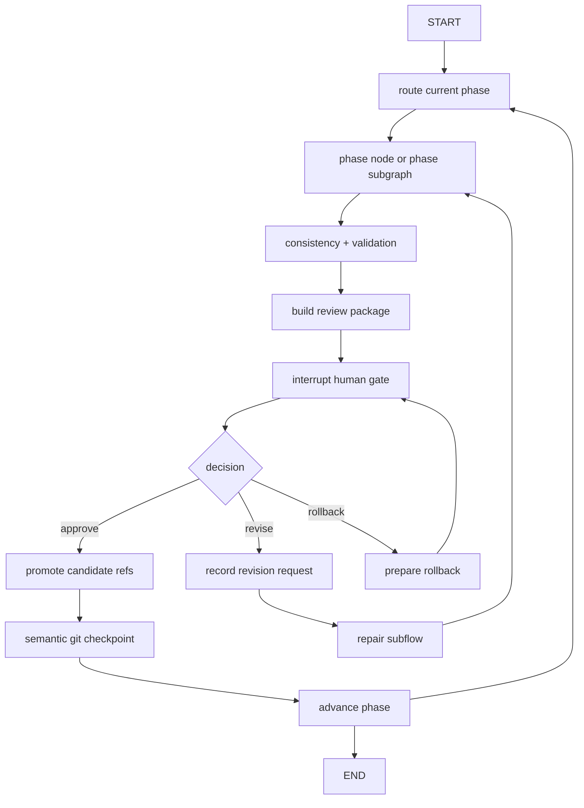

# 02 - Target Architecture

Date: 2026-06-22

## Design Principles

1. MCP is the product boundary.
2. LangGraph is the execution engine.
3. ArtifactStore is the durable production record.
4. Git checkpoints are semantic approval milestones.
5. LangGraph checkpoints are operational execution memory.
6. The Master Film Matrix is the production backbone, but it lives through versioned artifacts
   and row patches, not only in memory.
7. Validators must write structured findings that can block, repair, and explain.
8. Repairs should target the smallest safe unit of work.

## Target Runtime Flow



The runtime should not call `approve_phase_node()` or `request_revision_node()` directly as the
primary path. Those transitions should happen inside graph execution after `Command(resume=...)`.

## State Model

Use a typed state contract. Start with `TypedDict` because it is lighter than a large Pydantic
state model and fits LangGraph reducers well.

Suggested channels:

```python
from operator import add
from typing import Annotated, NotRequired, TypedDict

class StudioGraphState(TypedDict, total=False):
    project_id: str
    current_phase: str
    pending_action: str
    approved: bool

    artifact_refs: Annotated[list[str], add]
    issues: Annotated[list[dict[str, object]], add]
    validation_report_refs: Annotated[list[str], add]
    review_package_refs: Annotated[list[str], add]
    audit_event_refs: Annotated[list[str], add]

    active_matrix_ref: str
    active_matrix_patch_refs: Annotated[list[str], add]
    active_row_ids: list[str]

    budget_snapshot: dict[str, object]
    provider_health_snapshot: dict[str, object]
    revision_request_ref: NotRequired[str]
    repair_feedback_ref: NotRequired[str]
```

Rules:

- Store refs and small projections in graph state.
- Store large artifacts, review packages, validation reports, and matrix patches in ArtifactStore.
- Do not store `GraphServices` in state. Pass services through runtime/config or create nodes
  from injected services.
- Nodes return partial updates.
- Append-only channels use reducers. Scalar channels replace.

## Checkpoint Model

Use two checkpoint layers.

### LangGraph checkpointer

Purpose:

- resume after interrupts
- recover from process failure
- inspect state by thread
- support time travel during debugging

Use a stable `thread_id` derived from `project_id`.

For local development, an in-memory checkpointer can prove the behavior. For product completion,
use a durable file or sqlite-backed checkpointer if available in the pinned LangGraph version.

### Git semantic checkpoints

Purpose:

- approved phase milestones
- rollback and branch exploration
- human-readable audit history
- production handoff and compliance

Keep the current `CheckpointManager`, but call it after graph-level approval transitions, not as a
replacement for graph persistence.

## Human Gates

Replace the self-looping `await_approval` passthrough with a real interrupt node.

The interrupt payload should be JSON-serializable and should contain refs, not large embedded
artifact bodies:

```python
def await_approval_node(state: StudioGraphState) -> dict[str, object]:
    payload = {
        "project_id": state["project_id"],
        "phase": state["current_phase"],
        "artifact_refs": state.get("artifact_refs", []),
        "validation_report_refs": state.get("validation_report_refs", []),
        "review_package_refs": state.get("review_package_refs", []),
        "blocking_issue_count": count_blocking(state),
        "allowed_actions": ["approve", "request_revision", "rollback"],
    }
    decision = interrupt(payload)
    return normalize_review_decision(decision)
```

Important LangGraph constraint:

- `Command(resume=...)` is the graph input used to resume an interrupt.
- `Command(update=..., goto=...)` is a node return pattern.
- Do not use `Command(update=...)` as graph input for normal continuation.

## Artifact Versioning And Lineage

Fix `_save_artifact()` before relying on repair loops.

Required behavior:

- Allocate the next version per `(project_id, phase, artifact_id)`.
- Write metadata with parent refs.
- Include `created_by` as the actual agent id when known.
- Attach `validation_refs`, `approval_ref`, and `kb_context_ref` when available.
- Return `artifact:{artifact_id}:v{version}`.

Artifact metadata already has useful fields. The gap is wiring.

Recommended addition:

```python
class ArtifactMetadata(...):
    built_from: dict[str, str] = Field(default_factory=dict)
    change_summary: str = ""
```

If changing the schema is too broad, represent `built_from` initially as a sidecar artifact.

## Living Matrix Design

The matrix should become living without abandoning artifact durability.

### Current issue

`shot_matrix.v1.json` is created, but downstream phases do not update:

- `prompt_ref`
- `provider_plan_ref`
- `asset_refs`
- `validation_refs`
- `post_refs`
- `status`

### Target

Use a base matrix plus versioned patches.



Each patch contains:

- target base matrix ref
- phase
- reason
- row updates by `shot_id`
- old refs when needed for rollback
- validator refs or generation job refs
- approval state

Example patch:

```json
{
  "matrix_ref": "artifact:shot_matrix:v1",
  "phase": "gen_planning",
  "updates": [
    {
      "shot_id": "shot_0001",
      "set": {
        "prompt_ref": "artifact:prompt_shot_0001:v1",
        "provider_plan_ref": "artifact:provider_plan_shot_0001:v1",
        "status": "prompted"
      }
    }
  ]
}
```

This keeps changes small, auditable, and repairable.

### Why patches beat in-memory mutation

| Concern | In-memory matrix | Versioned matrix patches |
|---|---|---|
| Crash recovery | Depends on checkpointer | Durable in ArtifactStore |
| Audit | Hidden in state snapshots | Explicit artifacts |
| Rollback | Requires state replay | Invalidate or revert patch refs |
| MCP inspection | Requires graph state access | Normal artifact inspection |
| Large films | Checkpoints grow | State carries refs/projections |
| Review diffs | Need custom state diff | Patch is the diff |

Graph state can still cache a materialized matrix projection for the active phase. The durable
record should be patch artifacts.

## Context Strategy

Stop treating full artifact JSON as the default prompt context.

Use scoped context packets:

- Development gets constitution summary and project profile.
- Script gets treatment, scene list, character constraints, and target runtime.
- Visual dev gets script scene/environment needs and style constraints.
- Shot bible gets execution brief, script scene map, visual reference ids, and row schema.
- Gen planning gets only planned rows and provider/budget policy.
- Generation gets a batch of ready rows, prompt refs, provider plan refs, and continuity anchors.
- QC gets artifact refs plus targeted excerpts per validator.

The KB module already has packet/retrieval concepts. The graph should use them for artifact
context too: compact, typed, phase-specific packets instead of truncated whole JSON.

## Repair Model

Repair should be structural.

Current repair feedback is a string assembled from blocking issues. Target feedback should be a
typed artifact or state ref:

```json
{
  "phase": "shot_bible",
  "round": 1,
  "failed_rows": [
    {
      "shot_id": "shot_0003",
      "issues": [
        {
          "code": "duration_out_of_range",
          "field": "duration_seconds",
          "required_change": "set to 3-12 seconds"
        }
      ],
      "preserve_other_fields": true
    }
  ],
  "global_issues": [
    {
      "code": "shot_count_mismatch",
      "required_change": "add 4 rows to act_2"
    }
  ],
  "passed_row_ids": ["shot_0001", "shot_0002"]
}
```

Repair nodes should:

- record a revision request artifact
- clear or supersede stale blocking issues
- pass structured feedback to the phase node
- preserve known-good rows where possible
- save repaired artifacts as new versions
- stop after convergence rules and interrupt for human guidance

## Subgraph Strategy

Do not subgraph everything at once.

Start with subgraphs where they remove real complexity:

1. Approval gate subgraph
   - build review package
   - interrupt
   - normalize decision
   - approve/revise/rollback route

2. QC subgraph
   - load artifact refs
   - fan out validators with `Send`
   - reduce reports
   - build consensus
   - save report artifact

3. Generation batch subgraph
   - fan out generation requests
   - poll/resume provider jobs
   - ingest outputs
   - write matrix asset patch

Use `Send` when each worker gets a different state slice, such as one validator task or one
generation request. Use normal edges when all nodes share the same state.

## Target Top-Level Graph



## Non-Goals

- Do not replace ArtifactStore with LangGraph Store.
- Do not move large binary or large JSON artifacts into graph state.
- Do not adopt LangGraph Cloud as a local product requirement.
- Do not build generic abstraction layers before the first approval/interrupt path works.
- Do not parallelize paid provider execution until idempotency and checkpointing are proven.
