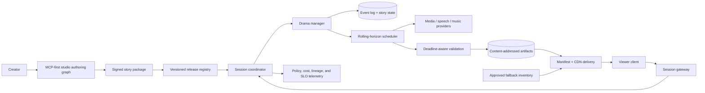

# Technical Feasibility and Candidate Architecture

## Bottom line

A bounded hybrid system is technically plausible. A fully generative, photorealistic,
multi-character movie created synchronously for each viewer is not established by current
public evidence.

The feasible architecture does three things current “prompt-to-video” demos often avoid:

1. makes typed story state—not generated pixels—the source of truth;
2. prepares multiple future segments before the viewer needs them;
3. always has a governed playable fallback.

This means the system is interactive at the story-decision timescale, not necessarily at the
frame-generation timescale.

## Candidate execution models

Scores are architectural judgments for the anchor, not measured benchmarks. `5` is favorable.

| Model | Agency | Playback latency | Continuity | Creator control | Cost predictability | Prototype fit |
|---|---:|---:|---:|---:|---:|---:|
| Pre-rendered branch graph | 2 | 5 | 5 | 5 | 4 | 5 as control |
| Authored scenes + generated dialogue/transitions | 3 | 4 | 4 | 4 | 3 | 5 |
| Rolling-horizon generated segments | 4 | 3 | 3 | 3 | 2 | 4 after earlier gates |
| Game engine + generative drama/performance | 4 | 5 | 5 | 4 | 4 | 3; separate production stack |
| Fully neural interactive world | 5 | 4 | 2 | 1 | 1 | 1; research watch |

Google DeepMind describes Genie 3 as a 720p, 24-fps interactive world model with consistency
for a few minutes, but lists limited action space, complex multi-agent interaction, and duration
as limitations
([official overview](https://deepmind.google/blog/genie-3-a-new-frontier-for-world-models/),
accessed 2026-08-25). GameNGen demonstrated a neural simulation of one already-known game at
20 fps on one TPU
([ICLR 2025 paper](https://openreview.net/pdf?id=P8pqeEkn1H), accessed 2026-08-25).
Neither result proves authored multi-character drama, speech, cinematic editing, safety, branch
audit, or the anchor's economics. They do prove that real-time action-conditioned video is no
longer purely speculative.

## Proposed system shape

Keep the existing studio as the **authoring and publication control plane**. Add an isolated
**interactive session runtime** that consumes a compiled, approved story package. Do not make
the current phase graph serve every playback event.



### Control plane

- project, story-package, provider-policy, and release management;
- creator review and approval;
- representative branch simulation;
- rights, safety, accessibility, and territory policies;
- checkpoints and publication rollback;
- MCP tools and inspectable artifacts.

### Session plane

- low-cardinality viewer interventions;
- idempotent intent mapping and consequence commits;
- per-session event ordering;
- branch state snapshots;
- time-bounded planning, validation, and fallback;
- cancellation of invalidated future work.

### Media plane

- asynchronous video, image, dialogue, voice, music, compositing, and caption jobs;
- reference packets and provider-specific adapters;
- content-addressed storage and branch deduplication;
- deadline, cost, region, rights, and policy-aware routing;
- direct media delivery rather than proxying bytes through MCP.

MCP remains the product control boundary. It can expose `start_interactive_session`,
`submit_intervention`, `inspect_session`, `fork_session`, `replay_version`, and
`terminate_session`. Playback uses a signed manifest/media data path created and governed by
those tools; this is delivery, not a hidden alternative control API.

## Rolling horizon

At any moment, the runtime maintains four horizons:

| Horizon | Meaning | Mutability |
|---|---|---|
| H0 — delivered | Already played media and committed facts | Immutable |
| H1 — committed | Validated next segment ready in the playback buffer | Media immutable; may be skipped only by explicit transition policy |
| H2 — candidates | Likely next branches generated or selected ahead | Cancelable and garbage-collectable |
| H3 — dramatic plan | Abstract obligations, paths, and ending viability | Replanned after every accepted intervention |

The client plays H0/H1 while the scheduler fills H2. At a decision window:

1. acknowledge and classify input;
2. validate authority, safety, canon, and reachable endings;
3. atomically commit a consequence contract and state event;
4. select a ready candidate or generate within the consequence deadline;
5. fall back to an authored/cached branch if the deadline or validation budget is exhausted;
6. cancel H2 work made unreachable by the commit;
7. replenish the buffer.

The system must never play an uncommitted provider result merely because it arrived first.

## State and transaction model

### Proposed typed objects

These are conceptual Pydantic boundaries, not implementation in this research phase.

```text
StoryPackage
  package_id, project_id, version, constitution_ref, state_schema_ref,
  storylets, ending_classes, fallback_refs, policy_refs, provider_policy,
  release_signature

InteractiveSession
  session_id, package_id, viewer_policy_ref, active_branch_id,
  committed_event_seq, current_segment_id, status, region, created_at

StoryStateSnapshot
  branch_id, event_seq, facts, character_states, relationships,
  obligations, reachable_endings, timeline, delivered_segments, digest

Intervention
  intervention_id, session_id, expected_event_seq, raw_input_ref,
  normalized_intent, authority, received_at, idempotency_key

ConsequenceContract
  intervention_id, causal_effects, immutable_constraints, response_deadline,
  response_distance, candidate_storylets, fallback_ref, validation_policy

PlayableSegmentManifest
  segment_id, state_before_digest, state_after_digest, media_refs,
  access_track_refs, provenance_refs, validations, provider_receipts,
  cost_receipt, release_policy, content_digest
```

### Commit protocol

- `expected_event_seq` provides optimistic concurrency control.
- An intervention ID and idempotency key prevent duplicate consequences.
- The consequence contract and state delta are validated before append.
- The append is the narrative commit point; media jobs reference it.
- A segment manifest can commit only if its `state_before_digest` matches the branch and all
  hard validators pass.
- Delivery acknowledgement advances the immutable delivered frontier.
- Recovery reconstructs state from the event log plus snapshots; it does not infer state from
  generated media.

This supports semantic determinism even when media providers are stochastic. Exact media replay
comes from retained artifacts and hashes.

## Latency budget

The plan's p95 targets are hypotheses. A viable prototype needs an explicit allocation such as:

| Work | Candidate p95 budget | Deadline behavior |
|---|---:|---|
| Gateway, auth, idempotency | 100 ms | Reject safely |
| Intent classification and repair | 400 ms | Offer bounded choices |
| State/rights/safety pre-check | 500 ms | Decline or repair |
| Consequence planning and commit | 1.5 s | Use precomputed valid intent path |
| Candidate lookup / cache | 100 ms | Schedule generation |
| New audiovisual generation | 20–25 s | Must run behind playable buffer |
| Hard media validation and packaging | 3 s | Use fallback |
| Manifest publication | 200 ms | Retry idempotently |

These values do not add directly when work is parallel and prefetched. They also do not prove
that a provider can generate a valid segment in 25 seconds. The prototype must record actual
queue, compute, moderation, validation, retry, and packaging times separately.

The interaction UI can acknowledge immediately, while a short authored bridge continues the
story. It must not show a fake progress animation and call that uninterrupted playback.

## Deadline-aware validation

Validation must be split by when it can still prevent harm or failure.

### V0 — package-time exhaustive checks

Schema, reachability, invariant conflicts, rights coverage, fallback coverage, policy and
access-track completeness, representative branch simulation.

### V1 — intervention-time checks

Authentication, input policy, intent vocabulary, canon permissions, reachable ending, budget,
and denial-of-wallet limits. Fail closed before state commit.

### V2 — pre-playback hard checks

Manifest/state match, identity references, disallowed content, required speech/captions,
duration, encoding, provenance, and critical continuity. A failure selects fallback.

### V3 — post-delivery quality checks

Deeper narrative and audiovisual evaluation, sampled human review, drift detection, and
creator feedback. V3 can quarantine future use or a release, but must never be the first place
a known safety rule runs.

Validators need declared cost and worst-case latency. Consensus among slow model reviewers is
not suitable for every live decision.

## Media strategy

### Generate selectively

The first audiovisual prototype should pre-author:

- establishing shots and scene geography;
- key emotional close-ups and ending beats;
- safety fallbacks and interaction bridges;
- stable character/voice/environment references;
- music stems and access-track templates.

Generate or adapt:

- bounded dialogue and voice performance;
- inserts, reaction shots, transitions, and short consequence shots;
- shot ordering within approved grammar;
- captions and localization drafts, subject to validation.

This yields recognizable consequence at much lower continuity and latency risk than generating
every frame.

### Provider contract additions

An interactive provider adapter needs more than `submit` and `poll`:

- deadline and priority;
- cancellation and cancel receipt;
- idempotency behavior;
- partial/streaming capability;
- reference and seed semantics;
- content-policy and rights constraints;
- regional execution and retention policy;
- estimated and actual cost;
- model version and deprecation date;
- deterministic artifact digest after ingestion;
- queue and generation timing.

Provider output is untrusted input until ingested and validated.

## Continuity architecture

Continuity is a set of independently testable contracts:

- **narrative:** facts, causality, obligations, chronology;
- **character:** visual identity, voice, knowledge, motivation, relationship;
- **environment:** topology, time, lighting, weather, object positions;
- **performance:** emotion, eyelines, body state, blocking;
- **cinematography:** aspect, lens/camera grammar, screen direction, coverage;
- **edit:** action match, spatial comprehension, pace, audio bridge;
- **sound:** voice identity, ambience, music state, loudness;
- **access:** captions, speaker identity, audio description, locale meaning.

Each playable manifest names the required continuity anchors and the validator evidence. A
single “coherence score” would hide which contract failed.

## Failure semantics

| Failure | Required behavior |
|---|---|
| Duplicate intervention | Return original result; never double-apply state |
| Conflicting simultaneous input | Reject stale `expected_event_seq`; show committed choice |
| Planner timeout | Use precomputed valid consequence or bounded choice |
| Provider queue/timeout | Continue bridge, then select cached fallback before stall deadline |
| Invalid media | Quarantine output, do not play, use fallback, retain receipt |
| Validator unavailable | Fail closed for hard validators; fallback |
| Session worker crash | Rehydrate from event log/snapshot and redeliver committed manifest |
| Client disconnect | Preserve session lease; resume from delivered frontier |
| Cost cap reached | Stop speculative work; use authored path or end safely |
| Release revoked | Block new sessions; apply explicit policy to active sessions; preserve audit |
| Provider/model retired | Replay retained artifacts; new generation routes only to approved compatible provider |

The product should prefer an honest authored continuation over an unvalidated “magical” result.

## Capacity and storage model

For `N` concurrent sessions, `C` candidate branches per window, segment duration `D`, generation
time `G`, and usable candidate probability `q`, approximate required concurrent generation jobs:

```text
jobs ≈ N × C × G / D × prefetch_factor / q
```

This is intentionally a queueing approximation, not a capacity claim. The measured model must
also include provider quotas, abandoned candidates, retries, validation, and peak arrival
bursts.

Store artifacts content-addressably and let manifests reference them. Garbage collection may
delete unreachable, unshared candidate media after a retention window, but cannot delete
delivered or incident-held evidence while its policy requires retention. Story state remains
small; generated media dominates storage and egress.

## Observability

Every intervention needs one trace across:

- gateway acknowledgement;
- intent mapping and repair;
- policy and canon decisions;
- state commit;
- candidate selection and cancellation;
- provider queue/generation;
- validation;
- manifest publication;
- client playback and stall;
- cost receipt.

Core metrics include p50/p95/p99 consequence latency, playable-buffer seconds, fallback and
rejection rates, invalid candidates, continuity defects per delivered minute, cost per
successful viewer-minute, wasted speculative cost, ending distribution, and recovery time.
Raw viewer prompts and sensitive profile data should not be default metric labels or logs.

## Security boundaries

- Treat raw direction, provider output, shared branches, and creator uploads as untrusted.
- Separate user text from hidden constitutions and tool instructions.
- Give the drama manager typed actions, not arbitrary tools or filesystem/network access.
- Authorize session, branch, artifact, and fork separately.
- Sign release and segment manifests; hash event chains and artifacts.
- Rate-limit both viewer input and speculative generation to prevent denial-of-wallet.
- Bind provider credentials to narrow server-side adapters; never expose them to clients.
- Minimize and expire raw directions after dispute/safety requirements are satisfied.

## Feasibility conclusion

The existing ecosystem can plausibly support a story-state prototype and a selective-media
hybrid. The hard unknowns are not whether an LLM can invent a next scene; they are whether the
complete loop can deliver meaningful agency, dramatic closure, validated media before a real
deadline, creator inspectability, and sustainable cost.

Therefore:

- pre-rendered branching is the baseline;
- text/storyboard rolling-horizon is the first proof;
- generated dialogue/transitions are the first audiovisual proof;
- a full rolling hybrid is conditional;
- a neural real-time movie remains research-only until multi-character drama, long-horizon
  state, safety, replay, and economics are independently demonstrated.
