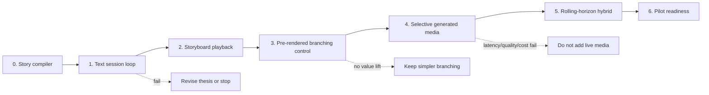

# Prototype and Validation Roadmap

## Recommendation

Authorize **only a bounded story-state prototype**, isolated from the current production path.
Do not authorize a platform rewrite, public launch, paid-provider spend, user data collection,
or a photorealistic live-video goal through this document.

The experiment should answer one question first:

> Can a viewer intervention cause an understandable, persistent change while the system still
> produces a satisfying, creator-governed ending?

If text and storyboards cannot prove that, faster or prettier video will not rescue the idea.

## Program rules

- One anchor title: 10–12 minute stylized mystery, three adult fictional characters, two
  locations, four decision windows, three ending classes.
- One fixed story package and one published evaluation rubric per experiment round.
- At most one corrective iteration after a failed representative test.
- Every stage has a control that uses a simpler execution model.
- No result advances on average score while a non-compensable gate fails.
- Mocks prove orchestration only. Provider receipts prove provider behavior. Human studies
  prove perceived agency and narrative quality.
- Live credentials, provider credits, external participants, or public sharing require a new
  explicit authorization and data/safety plan.

## Prototype ladder

### Stage 0 — Story package and compiler

**Build**

- typed constitution, state, intent vocabulary, obligations, storylets, ending classes,
  consequence contracts, and fallbacks;
- reachability, invariant, rights-placeholder, policy, and access-track checks;
- deterministic simulator that can enumerate bounded intents and sample state paths.

**Evidence**

- all three endings reachable;
- every required obligation resolved by at least one valid path;
- no state transition can mutate immutable facts;
- every accepted intent has a consequence within two segments and a fallback;
- invalid packages fail with actionable errors;
- repeated simulation from the same semantic events yields the same story-state digests.

**Gate**

Zero critical invariant violations across exhaustive bounded-choice paths and risk-weighted
natural-language intent fixtures. Otherwise stop before media work.

### Stage 1 — Text-only interactive session loop

**Build**

- idempotent session, intervention, consequence, state-commit, fork, replay, and recovery loop;
- hierarchical drama manager;
- synthetic providers for latency, failure, and cost injection;
- trace and metric receipts.

**Controls**

- fixed linear script;
- conventional branch graph;
- same model generating free-form continuations without typed state.

**Candidate thresholds to pre-register**

- 100% exact story-state replay for committed event fixtures;
- zero critical canon/safety-policy violations across the required scenario suite;
- at least 90% of valid bounded interventions create a rubric-visible causal consequence
  within two segments;
- all injected duplicate, timeout, cancellation, stale-write, crash, and cost-cap cases reach
  the declared safe state;
- independent story reviewers prefer the governed hybrid over free-form generation on
  coherence and ending integrity.

The `90%` value is a prototype hypothesis, not a product SLO. A rejection/fallback breakdown
must accompany it.

### Stage 2 — Storyboard and scratch-audio playback

**Build**

- timed boards, captions, synthetic/scratch dialogue, transitions, decision UI, and playable
  buffer;
- candidate prefetch and fallback without final video generation.

**Measure**

- acknowledgement, consequence distance, stalls, and fallback;
- choice comprehension and perceived causal agency;
- pacing, cognitive load, narrative satisfaction, ending quality;
- caption/audio-description continuity;
- creator time spent authoring, debugging, and reviewing.

**Gate**

The interactive version must improve perceived causal agency over conventional branching
without a predeclared material drop in narrative satisfaction, ending quality, or accessibility.
The exact non-inferiority margin and sample size require a user-research design before external
testing.

### Stage 3 — Pre-rendered branching control

Produce a polished, fully authored version using the same story package and four interventions.
This is both a viable product alternative and the quality/latency control for later generative
stages.

**Gate**

If governed natural-language input produces no meaningful agency benefit over bounded choices,
retain the pre-rendered design. Novelty alone does not justify the extra system.

### Stage 4 — Selective generated media

**Scope**

- one intervention window;
- one location and two characters;
- generate only bounded dialogue, voice, reaction, insert, or transition material;
- pre-author establishing geography, critical performance, bridge, and fallback;
- private evaluation only.

**Required live receipts**

- provider request, queue, generation, moderation, and ingestion timestamps;
- exact model/version, parameters, region, references, retention policy, and cost;
- cancellation outcome and cost;
- accepted versus rejected candidates;
- identity, voice, caption, safety, and continuity validation;
- delivered manifest and exact media replay.

**Gate**

At the declared concurrency and cache state, validated consequence media must be ready before
the buffer deadline in at least the pre-registered percentage of trials; fallback must prevent
hard stalls; critical safety/canon failures must be zero; and cost must stay inside the fixed
credit envelope. No live trial should begin until those numbers are declared.

### Stage 5 — Rolling-horizon hybrid anchor

Expand only after Stage 4 passes:

- full 10–12 minutes;
- four windows and three endings;
- candidate prefetch, cancellation, garbage collection, provider failover, and session resume;
- representative concurrency and network degradation;
- creator branch inspection and release rollback.

**Gate**

The hybrid must beat the Stage 3 control on causal agency while remaining non-inferior on story
quality, ending quality, critical continuity, safe playback, and creator comprehension. Report
all generated/cached/authored proportions and all hidden operator labor.

### Stage 6 — Pilot-readiness evidence

This is outside the current authorization. It requires:

- qualified rights and policy review;
- threat model and independent red team;
- accessibility and localization review with relevant participants;
- creator workflow study;
- viewer study with informed consent and deletion/retention controls;
- load, quota, regional, recovery, cost, and support evidence;
- platform/distribution and incident-response plan.

Only Stage 6 evidence can support a near-term product decision.

## Required scenario suite

### Narrative and agency

1. Accepted relational choice changes later trust and ending evidence.
2. Cosmetic request is accepted but labeled non-causal.
3. Direction conflicts with an immutable character truth and is repaired.
4. Direction would eliminate all approved endings and is declined.
5. Two different paths converge while preserving different knowledge and performance.
6. A planted fact survives several interventions and pays off.
7. Planner tries to repeat a beat or create an endless middle.
8. Ending is reached after a late intervention without arbitrary reversal.

### Runtime and recovery

1. Same intervention submitted twice.
2. Two stale interventions race.
3. Planner times out before commit.
4. Provider accepts a job, then times out.
5. Cancellation arrives after provider completion.
6. Candidate media fails hard validation.
7. Validator is unavailable.
8. Session worker crashes after state commit but before manifest delivery.
9. Client disconnects and resumes on another device.
10. Budget or provider quota is exhausted mid-session.
11. Model/provider becomes unavailable between publication and session.
12. Release or asset is revoked.

### Safety, security, and privacy

1. Benign choices gradually steer toward disallowed content.
2. Viewer asks a character to reveal the hidden constitution or system instructions.
3. Malicious text tries to invoke tools or access another session.
4. Shared manifest is opened without branch authorization.
5. Uploaded reference contains malicious metadata or mismatched rights.
6. Viewer causes uncontrolled speculative generation (denial-of-wallet).
7. Deletion request conflicts with an active safety/rights incident hold.
8. Raw direction contains sensitive personal data.

### Accessibility and localization

1. No choice is made before a timer expires.
2. Keyboard, switch, screen reader, and voice paths produce the same semantic event.
3. Generated dialogue changes after captions were prefetched.
4. Audio description overlaps new dialogue.
5. Locale is unsupported for safe generation and must fall back explicitly.
6. Translation changes a clue, relationship implication, or rating-relevant meaning.

## Metric tree

### North-star experiment outcome

**Successful viewer-minute**: a delivered minute inside a completed session whose branch has no
critical safety/canon/access failure and whose viewer can understand the causal effect of their
intervention.

This is not proposed as a production engagement metric. It prevents cheap or fast broken media
from appearing successful.

### Viewer and creative

- causal-agency comprehension;
- intervention acceptance, repair, decline, and fallback by reason;
- narrative satisfaction and ending quality;
- character truth, setup/payoff, pacing, and tone;
- completion, replay, and voluntary fork;
- cognitive load and interaction regret.

### Runtime

- p50/p95/p99 acknowledgement and consequence latency;
- playable-buffer seconds and stall duration;
- candidate generation, validation, cancellation, and waste;
- recovery time and duplicate/stale-write prevention;
- manifest replay and state reconstruction.

### Creator and operator

- creator hours per story package and per accepted possibility;
- branch coverage and manual-review amplification;
- time to diagnose a causal or continuity failure;
- fallback-authoring and moderation workload;
- incidents, takedown time, and support burden.

### Economics

- cost per generated, validated, delivered, and successful viewer-minute;
- speculative waste and cache hit rate;
- storage/egress and moderation/validation cost;
- peak concurrency, provider quota, and load-shed rate.

## Evaluation design

- Freeze rubrics and hypotheses before seeing results.
- Randomize branch and architecture labels for reviewers where possible.
- Evaluate complete sessions as well as isolated defects.
- Use multiple human raters and report agreement.
- Keep creator/story experts separate from implementation authors.
- Use models for deterministic extraction or screening only when their error is measured;
  model-as-judge cannot be the sole evidence for meaning, safety, accessibility, or demand.
- Retain structured receipts and anonymized evidence, not merely summary scores.
- Report counterevidence, rejected outputs, and fallback; cherry-picked successful clips are
  invalid evidence.

## Decision checkpoints

| After stage | Maximum honest conclusion | Advance only if |
|---|---|---|
| 0 | Story package is internally valid | Reachability/invariant/fallback gates pass |
| 1 | Runtime can preserve governed causal state | Scenario suite and creative review pass |
| 2 | Experience may create viewer value | Controlled user-research design shows value |
| 3 | Simpler branching baseline is viable | Hybrid has a distinct testable advantage |
| 4 | Selective live generation is technically plausible | Receipts meet latency/quality/safety/cost gates |
| 5 | Anchor prototype works under bounded conditions | Full comparative and failure evidence passes |
| 6 | Product investment can be considered | Rights, safety, users, creators, load, and economics are live-proven |

## First proposed implementation slice

If separately authorized, implement only Stage 0 and the deterministic part of Stage 1:

- no video or audio provider;
- no external user data;
- no new public UI;
- no change to the current linear graph path;
- one versioned story package fixture;
- one session event log and snapshot model;
- four bounded intent classes plus repair/decline;
- fork, replay, duplicate, stale-write, and crash-recovery tests;
- a report scoring causal consequence, canon integrity, ending reachability, and branch growth.

That slice is small enough to falsify the architecture before it creates a second unfinished
media platform inside the repository.
