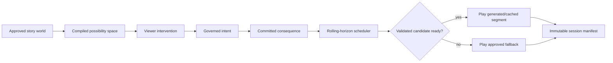

# Interactive Generative Cinema Research

Status: decision-grade desk research and repository adaptation study  
Evidence cutoff: 2026-08-25  
Decision: **Position 2 — research direction, with a conditional prototype path**

## The answer

The idea is a coherent, testable product thesis. The leading desk-research candidate is not
“let a model generate an entire movie frame by frame while someone watches.” It is
provisionally called **authored possibility cinema**:

- creators define a world, characters, immutable truths, dramatic obligations, mutable
  surfaces, and ending classes;
- viewers intervene at meaningful moments through choices or bounded natural-language intent;
- a drama manager commits a typed causal consequence;
- the system plays from a validated rolling buffer, selectively generates future material,
  and falls back to authored/cached media before playback breaks;
- every completed version has an inspectable state, policy, cost, provenance, and artifact
  manifest.

That product could feel new, but this has not been demonstrated. Bounded language may prove to
be only a better interface over conventional branching. Current evidence supports continued
research and a conditional, separately authorized experiment—not a prototype authorization.

## Decision in one table

| Question | Finding | Confidence |
|---|---|---|
| Is the concept distinct enough to research? | Yes. Current systems prove pieces, not the integrated experience; incremental viewer value remains speculative. | High |
| Has interactive cinema shipped before? | Yes; Netflix and earlier systems proved branching authoring/delivery, then Netflix retired its dedicated catalog without publishing a causal postmortem. | High |
| Can current systems generate interactive pixels in real time? | Research systems can for minute-scale worlds, but not the full multi-character cinematic contract. | Medium-high |
| Can current video APIs render the next film segment after a choice within 30 seconds? | Not as a dependable sole path; official docs describe asynchronous jobs often taking 90 seconds to minutes. | High |
| Is per-viewer full-video generation economically sensible now? | No as a consumer default. Illustrative quantified floors are roughly $45–$1,620 per 12-minute session before many costs. | Medium |
| Is a hybrid plausible? | Yes, if 70–95% of delivered media is authored/reused/local and generation is selective. The floor still spans roughly $2.46–$486, so only the low case approaches consumer economics. | Medium |
| Does this repository already implement it? | No. It has a strong authoring-plane foundation, not a live session runtime. | High for inspected snapshot |
| Should the current pipeline be rewritten? | No. Publish immutable interactive bundles and add an isolated event-sourced session runtime. | High |
| What should be built first? | Story compiler + deterministic text session loop, with no live video provider. | High |
| Can this research justify product investment? | No. Product direction requires live providers, creators, viewers, safety/accessibility, load, and full-cost evidence. | High |

## Why the hybrid is the leading candidate

The hybrid leads the desk-research comparison because it separates four responsibilities:

- story state decides what is true;
- the drama manager decides what is dramatically admissible;
- generation realizes a bounded segment;
- validation and fallback decide what may be played before a deadline.

A single generative model should not own all four.

## Current evidence boundary

External research establishes:

- interactive branching and buffered future segments can ship;
- deterministic simulated worlds can combine audience input, character planning, rendering,
  and streaming;
- free text can steer continuing text narratives and bounded game characters;
- research world models can generate interactive video at real-time frame rates for minutes;
- production clip APIs can generate useful short media, usually asynchronously.

It does **not** establish:

- better viewer value than a strong linear or pre-rendered branching film;
- three-character narrative, visual, voice, and causal continuity for the 10–12 minute anchor;
- creator review burden or sustainable authorship;
- end-to-end p95 latency including intent, policy, planning, queue, generation, validation,
  delivery, and recovery;
- safe, rights-cleared, accessible, localized, replayable operation;
- willingness to pay or sustainable contribution margin.

## Repository adaptation

Keep the existing LangGraph studio as the authoring/publication plane. Reuse its film
constitution, character/environment/story bibles, typed artifacts, validation conventions,
provider-job lifecycle, review gates, checkpoints, and MCP product boundary.

Add an isolated runtime that consumes a signed `InteractiveExperienceBundle` and owns:

- append-only session events and versioned story-state snapshots;
- idempotent interventions with optimistic concurrency;
- consequence contracts and ending reachability;
- rolling horizon, deadlines, fences, cancellation, and fallback;
- immutable playable-segment manifests and exact retained-media replay;
- per-intervention policy, provenance, SLO, and cost receipts.

Do not create a Git branch per viewer, write live state into project `current.json` artifacts,
or force the phase graph/human approval interrupt into the playback loop.

The repository audit executed 159 focused tests successfully with `--no-cov`. It did not run
full CI, live providers, playback, load, or security. The checkout contained unrelated source
modifications; re-audit after those settle.

## Conditional experiment

The current decision remains Position 2 until a concrete charter freezes a creative owner,
engineering and measurement owners, one title fixture, repository write boundary, maximum
elapsed days, maximum staff-hours, zero external-provider spend, local-compute ceiling, exit
report, and stop date. If that charter is explicitly authorized, build only Stage 0 and the
deterministic part of Stage 1:

1. one 10–12 minute stylized mystery package;
2. three fictional adult characters, two locations, four decision windows, three endings;
3. typed constitution, state, intent vocabulary, storylets, obligations, consequence
   contracts, and fallbacks;
4. deterministic simulator and reachability/invariant checks;
5. session event log with idempotency, fork, replay, stale-write, and crash recovery;
6. controls: linear script, pre-rendered branch graph, and free-form continuation;
7. independent complete-branch review for causal agency, character truth, setup/payoff,
   pacing, and ending quality.

No video provider is needed to answer the first question. Stop if the system cannot produce
meaningful causal agency without canon violations, high rejection, false choice, damaged
endings, or creator labor above the chartered ceiling.

## Non-negotiable prototype boundary

- fictional adults only;
- private sessions only;
- no real-person likenesses or cloned voices;
- no arbitrary uploads, public sharing, minors, biometrics, passive emotion inference,
  multiplayer, open world, or unrestricted sexual/violent content;
- no raw viewer prompt sent directly to tools or media providers;
- no segment plays without matching safety, continuity, rights, and access-track evidence;
- no accepted choice silently advances after generation/validation failure;
- no live provider spend or external study without a separate explicit decision.

## What would change the decision

Move from Position 2 to Position 3 only after the bounded charter above is fixed. Move toward
product investment only after:

- the governed prototype beats conventional branching on causal agency;
- narrative and ending quality remain within predeclared non-inferiority margins;
- creators can author, inspect, and repair branches at bounded effort;
- live provider receipts meet latency, acceptance, continuity, cancellation, and cost gates;
- fallback prevents stalls without negating agency;
- rights, safety, privacy, security, accessibility, and localization reviews pass;
- representative load and full contribution-margin evidence exist;
- a repeated-use viewer study shows value beyond novelty.

If the hybrid cannot beat pre-rendered branching, the correct result is not a larger model. It
is to keep the simpler product.

## Package index

1. [Research plan and quality bar](./00-research-plan.md)
2. [Concept and product thesis](./01-concept-and-product-thesis.md)
3. [Landscape and evidence](./02-landscape-and-evidence.md)
4. [Narrative and creator systems](./03-narrative-and-creator-systems.md)
5. [Technical feasibility](./04-technical-feasibility.md)
6. [Repository adaptation audit](./05-repository-adaptation.md)
7. [Prototype and validation roadmap](./06-prototype-and-validation-roadmap.md)
8. [Safety, rights, and governance](./07-safety-rights-and-governance.md)
9. [Economics, distribution, and operations](./08-economics-distribution-and-operations.md)
10. [Accessibility, localization, and measurement](./09-accessibility-localization-and-measurement.md)
11. [Claims and evidence ledger](./10-claims-and-evidence-ledger.md)
12. [Review record](./11-review-record.md)
13. [Source registry](./sources.md)

## Honest status

This package is a deep desk-research and architecture result. It contains one executed focused
repository test set. It contains no generated interactive film, no live media-provider receipt,
no user or creator study, no legal opinion, and no measured production load or unit economics.
Its recommendation is therefore intentionally bounded.
